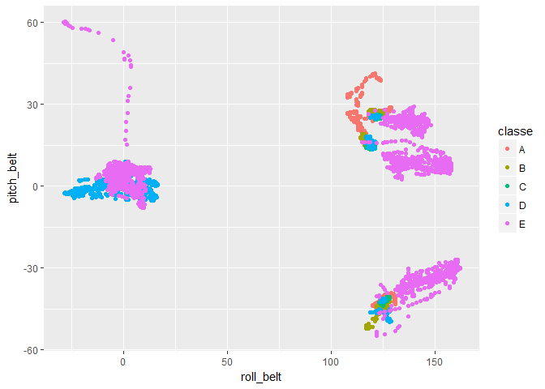
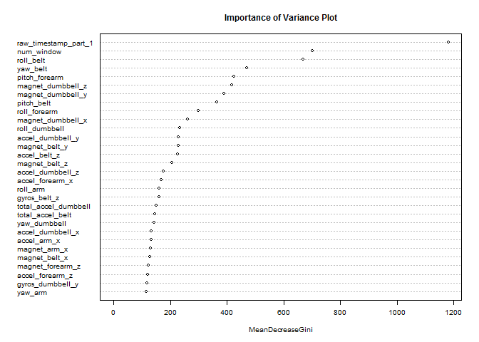

# Practical Machine Learning Project
Rishabh Joshi  
August 20, 2017  


## 1. Executive Summary

Nowadays, with the rapid advancement of technology, people are collecting large amounts of data about personal activity using devices such as *Jawbone Up, Nike FuelBand*, and *Fitbit*. One thing that people regularly do is quantify how much of a particular activity they do, but they rarely quantify how well they do it. 

In this project, our goal is to use data from accelerometers on the belt, forearm, arm, and dumbell of 6 participants and classify them into correct and improper movements.

Six young health participants were asked to perform one set of 10 repetitions of the Unilateral Dumbbell Biceps Curl in five different fashions: exactly according to the specification (Class A), throwing the elbows to the front (Class B), lifting the dumbbell only halfway (Class C), lowering the dumbbell only halfway (Class D) and throwing the hips to the front (Class E). **Our goal is to correctly classify the type of movement performed by the subject, given the different parameters collected by the accelerometers.**

## 2. Data Preprocessing

Loading the required packages.


```r
library(ggplot2)
library(caret)
library(lubridate)
library(dplyr)
library(randomForest)
library(kernlab)
# Set the seed for reproducibility purposes
set.seed(2017-20-08)
```

We will first download the training and testing dataset. This is required to create completely reproducible code.


```r
trainURL = "https://d396qusza40orc.cloudfront.net/predmachlearn/pml-training.csv"
testURl = "https://d396qusza40orc.cloudfront.net/predmachlearn/pml-testing.csv"
trainFile = "pml-training.csv"  # Training data
testFile = "pml-testing.csv"    # Testing data
if(!file.exists(trainFile))
    download.file(trainURL, trainFile)
if(!file.exists(testFile))
    download.file(testURl, testFile)
```

Reading the test and training data set. Since there are a lot of blank values in the training data, we will read all the columns as text data.


```r
tr = read.csv(trainFile, colClasses = "character")     
test = read.csv(testFile, colClasses = "character")    
```

Upon inspection, we need to convert a few columns into factor variables, one column in to date variable and all the remaining columns into numeric variables. We will perform these transformations simultaneously on the training and testing data.


```r
tr = mutate(tr, user_name = factor(user_name),
            cvtd_timestamp = dmy_hm(cvtd_timestamp),
            new_window = factor(new_window),
            classe = factor(classe))

test = mutate(test, user_name = factor(user_name),
              cvtd_timestamp = dmy_hm(cvtd_timestamp),
              new_window = factor(new_window))
```

Note that there is no `classe` variable in the `test` data. Now, all the remaining columns, which are still character variables, need to be converted to numeric. This way, the missing values will be encoded as `NA`.


```r
for(i in 1:ncol(tr))
    if(is.character(tr[,i]))
        tr[,i] = as.numeric(tr[,i])

for(i in 1:ncol(test))
    if(is.character(test[,i]))
        test[,i] = as.numeric(test[,i])
```


## 3. Exploratory Data Analysis

We need to predict the `classe` for each set of covariates. Lets have a look at how many of each class variables are present in the training data set.


```r
table(tr$classe)
```

```
## 
##    A    B    C    D    E 
## 5580 3797 3422 3216 3607
```

We can see that class A has much more number of entries than the other classes. This might be a problem since our predictions might also exhibit this behavior.

Since there are a lot of variables available to us, we need to figure out which of these variables are almost useless. We will do so by calculating which of these variables have a variance very close to zero, using the `nearZeroVar` function. These variables will, therefore, not be useful in explaining patterns in our data. We want to **remove the variables with close to zero variance**. Also, we will **remove the first two columns** because they are just the index of the row and the names of the subjects respectively. The fifth column is the date of the experiment. Since the date of the experiment will have nothing to do with how the movements were performed, we will **remove the fifth column** as well.


```r
# removing the first, second andd fifth column as described above
tr = select(tr, -c(1,2,5))
# use the nearZeroVar function to calculate variances of all columns
nsv = nearZeroVar(tr,saveMetrics = TRUE)
# find out the columns which are not near zero variance
columns = rownames(nsv)[!nsv$nzv]
# subset the training set to only those columns
tr = tr[,columns]
```

We also notice that there are some columns with extremely large number of `NA` values. Let's calculate the percentage of `NA` values in each column to investigate this.


```r
percent_na = apply(tr,2,function(x) (100*sum(is.na(x)))/length(x))
```

When we try to find out the column with minimum percentage of `NA` values that is also greater than zero, we see something interesting.


```r
min(percent_na[which(percent_na>0)])
```

```
## [1] 97.93089
```

This means either there are no `NA` values in a column, or there are more than 97.9% `NA` values in that column. Since these columns will not be very helpful in finding patterns in our data, we decide to **remove all of the columns which have more than 97.9% `NA` values**, and keep only those with 0% `NA` values.


```r
tr = tr[,which(percent_na==0)]
```

Now, that we have removed all the unnecessary columns from our training data, we also have to remove those columns from our testing data. We can do this by selecting the columns which are present in the `tr` data and subsetting only those columns from the `test` data.


```r
# names of all the columns left in the training data
final_columns = names(tr)
# removing the last name, because last name is "classe", which is not in testing data
final_columns = final_columns[-length(final_columns)]
# subsetting testing data with the final columns
test = test[,final_columns]
```

The `test` data provided to us is going to be used for the *Course Project Precition Quiz*. We cannot use this data to predict out of sample error because we do not know the value of the `classe` variable for this data. Therefore, we need to split our `tr` data into three sets, namely, `training` (for training the models), `validation` (for comparing different models), and `final_validation` (to estimate out of sample error). 


```r
inBuild = createDataPartition(y=tr$classe, p=0.8, list = FALSE)
training = tr[inBuild,]
final_validation = tr[-inBuild,]
inTrain = createDataPartition(y=training$classe, p=0.8, list = FALSE)
validation = training[-inTrain,]
training = training[inTrain,]
table(training$classe)
```

```
## 
##    A    B    C    D    E 
## 3572 2431 2191 2059 2309
```

```r
table(validation$classe)
```

```
## 
##   A   B   C   D   E 
## 892 607 547 514 577
```

```r
table(final_validation$classe)
```

```
## 
##    A    B    C    D    E 
## 1116  759  684  643  721
```

We see that the there are proportionately many instances of each type of `classe` in the `training` as well as `validation set`. This will help us estimate our test error nicely.

Operating on the `training` data alone, lets try to find out the most correlated variables with the `classe`.


```r
cr = abs(cor(training[,-56], as.numeric(training$classe)))
max(cr)
```

```
## [1] 0.3455215
```

The maximum absolute correlation is between `pitch_forearm` and `classe` which is 0.34. Therefore, there are no highly correlated variables with `classe`. Linear methods are unlikely to be helpful in this scenario.

Since, this is a classification problem, the first thing that comes to mind is decision trees based algorithms, such as random forests.

Looking at the plot between `roll_belt` and `pitch_belt`, we can observe that the data is being separated into some kinds of clusters, although nowhere near perfect. Looking at a few other plots netween some x, y, and z axes related features, we could find a similar partially clustered form of data. This gives us hope that fitting a random forest might be worth our while.


```r
qplot(roll_belt, pitch_belt, data = training, col = classe)
```

<!-- -->

## 4. Model Fitting

### (i) Random Forest

We will first build a random forest using all the variables as predictors.


```r
modRF = randomForest(training[,-56], training[,56])
modRF
```

```
## 
## Call:
##  randomForest(x = training[, -56], y = training[, 56]) 
##                Type of random forest: classification
##                      Number of trees: 500
## No. of variables tried at each split: 7
## 
##         OOB estimate of  error rate: 0.18%
## Confusion matrix:
##      A    B    C    D    E  class.error
## A 3571    1    0    0    0 0.0002799552
## B    5 2426    0    0    0 0.0020567668
## C    0    5 2186    0    0 0.0022820630
## D    0    0    6 2051    2 0.0038853813
## E    0    0    0    3 2306 0.0012992638
```

This model actually performs really well, with an out of bag error rate of 0.19%. Lets test this model on our `validation` set.


```r
predRF = predict(modRF,validation)
caret::confusionMatrix(validation$classe, predRF)$overall["Accuracy"]
```

```
##  Accuracy 
## 0.9980873
```

**Model Accuracy on the `validation` set = 99.81%**

Have a look at the Importance of Variance Plot for this random forest model to see which variables have the highest variable importance as measured by the Random Forest.


```r
varImpPlot(modRF, cex=0.6, main='Importance of Variance Plot')
```

<!-- -->

### (ii) Random Forest with PCA

Lets try to reduce some features using priciple components analysis because our results may be affected due to highly correlated features.


```r
#capture 99% variance through principle components
preProc = preProcess(training[,-56], method = "pca", thresh=0.99)   
trainPC = predict(preProc, training[,-56])
modRFPC = randomForest(trainPC, training[,56])
modRFPC
```

```
## 
## Call:
##  randomForest(x = trainPC, y = training[, 56]) 
##                Type of random forest: classification
##                      Number of trees: 500
## No. of variables tried at each split: 6
## 
##         OOB estimate of  error rate: 2.17%
## Confusion matrix:
##      A    B    C    D    E class.error
## A 3559    4    1    6    2 0.003639418
## B   59 2338   24    3    7 0.038255862
## C    4   34 2140   12    1 0.023277042
## D    5    0   77 1973    4 0.041767848
## E    0    6   16    8 2279 0.012992638
```

This model gives a worse out of bag error rate as compared to the model before even after capturing 99% of the variance through the principle components. Predicting on the `validation` set.


```r
validationPC = predict(preProc, validation[,-56])
predRFPC = predict(modRFPC,validationPC)
caret::confusionMatrix(validation$classe, predRFPC)$overall["Accuracy"]
```

```
##  Accuracy 
## 0.9725853
```

**Model Accuracy on `validation` set = 97.26%**

### (iii) Support Vector Machine with Cross Validation

Now let's try some SVM with linear kernel with 10 fold Cross Validation to see how it goes. First we need to set the `trainControl` measures to set up the cross validation part.


```r
tctrl = trainControl(method = "cv", number = 10)
modSVMCV = train(classe~., data=training, method = "svmLinear", trControl = tctrl)
modSVMCV
```

```
## Support Vector Machines with Linear Kernel 
## 
## 12562 samples
##    55 predictor
##     5 classes: 'A', 'B', 'C', 'D', 'E' 
## 
## No pre-processing
## Resampling: Cross-Validated (10 fold) 
## Summary of sample sizes: 11306, 11306, 11307, 11306, 11306, 11306, ... 
## Resampling results:
## 
##   Accuracy   Kappa    
##   0.7908791  0.7342388
## 
## Tuning parameter 'C' was held constant at a value of 1
```

This model gives an accuracy of 79.61%, which is quite poor compared to our previous accuracies. Predicting on the `validation` set.


```r
predSVMCV = predict(modSVMCV, validation)
caret::confusionMatrix(validation$classe, predSVMCV)$overall["Accuracy"]
```

```
##  Accuracy 
## 0.7765381
```

**Model Accuracy on `validation` set = 77.65%**

### (iv) Gradient Boosting Machine with Cross Validation

Now, we will train a final model using gradient boosting machine (gbm) with 10 fold cross validation.


```r
modGBMCV = train(classe~., data=training, method = "gbm", trControl = tctrl, verbose = FALSE)
modGBMCV
```

```
## Stochastic Gradient Boosting 
## 
## 12562 samples
##    55 predictor
##     5 classes: 'A', 'B', 'C', 'D', 'E' 
## 
## No pre-processing
## Resampling: Cross-Validated (10 fold) 
## Summary of sample sizes: 11306, 11306, 11307, 11306, 11306, 11306, ... 
## Resampling results across tuning parameters:
## 
##   interaction.depth  n.trees  Accuracy   Kappa    
##   1                   50      0.8090300  0.7578091
##   1                  100      0.8864053  0.8561825
##   1                  150      0.9162553  0.8939742
##   2                   50      0.9345662  0.9171616
##   2                  100      0.9753242  0.9687801
##   2                  150      0.9899706  0.9873147
##   3                   50      0.9652137  0.9559817
##   3                  100      0.9915625  0.9893287
##   3                  150      0.9964181  0.9954695
## 
## Tuning parameter 'shrinkage' was held constant at a value of 0.1
## 
## Tuning parameter 'n.minobsinnode' was held constant at a value of 10
## Accuracy was used to select the optimal model using  the largest value.
## The final values used for the model were n.trees = 150,
##  interaction.depth = 3, shrinkage = 0.1 and n.minobsinnode = 10.
```

Predicting on the `validation` set.


```r
predGBMCV = predict(modGBMCV,validation)
caret::confusionMatrix(validation$classe, predGBMCV)$overall["Accuracy"]
```

```
## Accuracy 
## 0.997131
```

**Model Accuracy on the `validation` set = 99.71%**

### (v) Stacking the models using Random Forest

Now that we have trained different models, we will see how stacking them together using Random Forests performs on the `validation set`.


```r
combined_train = data.frame(RF = predRF, RFPC = predRFPC, SVM = predSVMCV, GBM = predGBMCV)
combined_model = randomForest(combined_train, validation$classe)
combined_pred = predict(combined_model, combined_train)
caret::confusionMatrix(validation$classe, combined_pred)$overall["Accuracy"]
```

```
##  Accuracy 
## 0.9990437
```

**Model Accuracy on the `validation` set = 99.9%** 

### (vi) Selecting the final Model

Once again, looking at the accuracy on the `validation` set for all the models we built thus far.

1. Random Forest, `modRF` = 99.81%

2. Random Forest with PCA, `modRFPCA` = 97.26%

3. Linear SVM with Cross Validation, `modSVMCV` = 77.65%

4. GBM with Cross Validation, `modGBMCV` = 99.71%

5. Stacking models 1-4 with Random Forest, `combined_model` = 99.9%

Based on all the above accuracies we select the `combined_model` as our final model.

## 5. Estimating the Out of Sample Accuracy

Now, we will test our model on the `final_validation` set, only one time, to get the estimate of the out of sample accuracy for our chosen model.


```r
finValPredRF = predict(modRF, final_validation)
final_validationPC = predict(preProc, final_validation[,-56])
finValPredRFPC = predict(modRFPC, final_validationPC)
finValPredSVMCV = predict(modSVMCV, final_validation)
finValPredGBMCV = predict(modGBMCV, final_validation)
finValCombined = data.frame(RF = finValPredRF, RFPC = finValPredRFPC, SVM = finValPredSVMCV, GBM = finValPredGBMCV)
finValCombinedPred = predict(combined_model, finValCombined)
caret::confusionMatrix(final_validation$classe, finValCombinedPred)$overall["Accuracy"]
```

```
##  Accuracy 
## 0.9977058
```

**So our estimated out of sample accuracy is 99.77%.** 

## 6. Conclusion

In this report, we preprocessed the data and trained multiple models on the data. Then we selected the best model which was a stacked model containing all the other models based on the accuracy on the `validation` set. Finally we tested our model on the `final_validation` set to estimate the out of sample accuracy at 99.77%.
